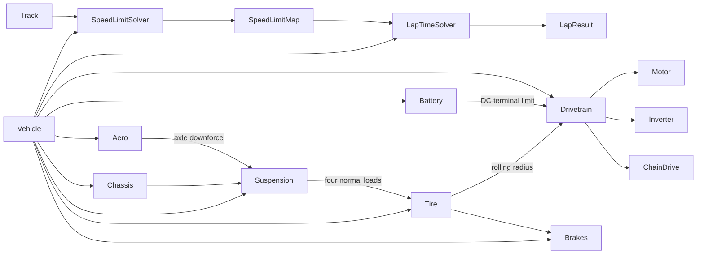

# Simulator architecture

The code is split into two packages with different responsibilities:

- `lapsim` owns tracks, controls, solvers, replay, and plotting.
- `vehicle_model` owns physical parameters, component state, and force/power
  calculations.

The lap solvers depend on component interfaces rather than a specific motor,
tire, or suspension implementation.



`Vehicle` is a coordinator. It does not own motor curves, aero coefficients,
or suspension parameters. Each component owns and validates its own
configuration and dynamic state. It binds the drivetrain's tire dependency to
the same `TireModel` instance owned by the vehicle, so rolling-radius geometry
has one source of truth.

`vehicle.py` stays at the top of `vehicle_model` because it coordinates every
domain. Implementations are grouped by the subteam that owns their physics:

| Subteam package | Ownership |
|---|---|
| `vehicle_model.electrical` | accumulator, OCV data, inverter |
| `vehicle_model.aero` | aerodynamic coefficients and forces |
| `vehicle_model.powertrain` | motor, chain drive, drivetrain coordination |
| `vehicle_model.mech` | chassis, suspension, tires, brakes, tire loads |

`interfaces.py` and `environment.py` remain at the top because they are shared
across subteams. `vehicle_model.__init__` re-exports the main classes, while
the subteam packages provide explicit ownership-oriented imports.

## Distance-domain vehicle integration

The spatial lap solvers query limits such as maximum tire force, maximum motor
torque, and braking deceleration. These calculations should be deterministic
for a given operating point; the solvers do not rely on a previous timestep's
mutable state.

Simulation and recorded-control replay call
`Vehicle.update_state(controls, distance_step_m)`. Distance is the independent
integration coordinate. The vehicle solves its final speed and elapsed time for
the cell, then updates time-dependent components with that internally derived
timestep. Call `Vehicle.reset_state()` before each independent run.

This keeps track curvature, driver controls, and comparisons aligned at the
same station even when simulated speed differs from measured speed. Temperature,
state of charge, slip relaxation, and other history-dependent behavior still
evolve in seconds, but time is output state rather than the integration input.

## Component ownership

| Component | Owns now | Natural future additions |
|---|---|---|
| `RCTheveninBattery` | OCV, SOC, current, ohmic drop, one-RC polarization, power limits | temperature, second RC branch, aging |
| `Inverter` | DC-to-motor efficiency | efficiency map, current/voltage limits, thermal state |
| `Motor` | peak/continuous torque curves, power limits, RPM limit, efficiency, rotor inertia | efficiency map, voltage dependence, thermal derating |
| `ChainDrive` | sprocket ratio, efficiency, input/output inertia | chain loss map, compliance, sprocket selection |
| `Drivetrain` | component coordination and driven-wheel inertia | regen coordination, coupled electrical limits |
| `Aero` | frontal area, drag/lift coefficients, aero balance | ride-height/yaw maps, active aero, center of pressure |
| `Chassis` | wheelbase, CG height, static weight distribution | track widths, roll centers, sprung/unsprung masses |
| `Suspension` | longitudinal load-transfer calculation | lateral transfer, roll stiffness, springs, dampers, heave/pitch |
| `Tire` | rolling radius, load-sensitive lateral/longitudinal coefficients, friction circle | loaded-radius model, combined slip, camber, pressure, temperature, wear |
| `Brakes` | ideal grip-limited friction braking | hydraulic map, brake balance, thermal limits, ABS |

The battery boundary is the DC pack terminal. The default one-RC pack model
computes OCV, ohmic drop, and polarization before that boundary; propulsion
conversion losses then continue through the inverter, motor, and chain drive.
The static `OCVPackBattery` and constant-power `Battery` models remain
available for comparisons.

## Telemetry ownership

Telemetry is schema-free and component-owned. Every component implements
`update_telemetry(telemetry: dict[str, float])` and writes its current scalar
signals under a namespaced key such as `motor.speed_rpm` or
`battery.terminal_voltage_v`. `Vehicle.telemetry_snapshot()` calls the vehicle
and every nested component writer to create one complete dictionary.

`TelemetryRecorder` accumulates snapshots into equal-length channel histories.
A component may add or omit optional signals without changing a central
telemetry dataclass; the recorder backfills unavailable samples with `NaN`.
The final `Telemetry` object implements `Mapping`, so channels can be accessed
with `telemetry["limits.traction_active"]` or exported with
`telemetry.as_dict()`.

## Shared data contracts

Components exchange small immutable result objects rather than reaching into
one another's implementation:

- `AeroForces` carries drag and front/rear downforce.
- `TireNormalLoads` carries all four normal loads.
- `Controls` carries driver or optimizer requests.

Keep new result objects in similarly focused modules. This prevents a solver
from becoming coupled to the fields of one detailed model.

## Source layout

```text
src/
|-- lapsim/
|   |-- controls.py
|   |-- speed_limit_solver.py
|   |-- lap_time_solver.py
|   |-- replay.py
|   |-- telemetry.py
|   |-- track.py
|   `-- plotting.py
|-- vehicle_model/
|   |-- interfaces.py
|   |-- vehicle.py
|   |-- environment.py
|   |-- electrical/
|   |   |-- battery.py
|   |   |-- battery_ocv.py
|   |   `-- inverter.py
|   |-- aero/
|   |   `-- model.py
|   |-- powertrain/
|   |   |-- drivetrain.py
|   |   |-- motor.py
|   |   `-- chain_drive.py
|   `-- mech/
|       |-- chassis.py
|       |-- suspension.py
|       |-- tire.py
|       |-- brakes.py
|       `-- loads.py
`-- utils/
    `-- units.py
```
